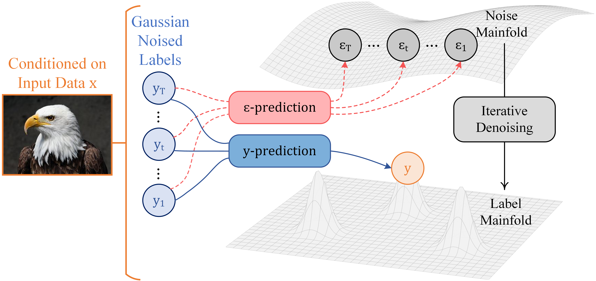

# Just Y-Prediction: Enabling Historical Cumulative Inconsistency in Label Diffusion for Learning with Noisy Labels

# Acceppted on ICML 2026

## Abstract

Label noise is pervasive in real-world datasets and significantly compromises model generalization, fueling extensive research into Learning with Noisy Labels (LNL). Most LNL methods focus on robust discriminative learning, while recent generative classifiers such as label diffusion models (LDMs) show superior robustness by modeling class posteriors. However, current LDMs predominantly rely on standard $\boldsymbol \epsilon$-prediction, where Gaussian noise lacks explicit class semantics, limiting both optimization and inference under label noise environments. To address this issue, we propose **just $\boldsymbol y$-prediction (JYP)**, a novel training paradigm that enables LDMs to directly characterize the label manifold and leverage explicit class-semantic guidance. Theoretically, we prove that JYP converges to an optimal solution equivalent to that of $\boldsymbol \epsilon$-prediction within the label diffusion framework, while facilitating accelerated convergence and enabling one-step inference. Leveraging JYP as a foundation, we further incorporate historical cumulative inconsistency to adaptively tailor optimization strategies for clean, noisy, and hard samples. Extensive experiments demonstrate that our method consistently outperforms competitors across diverse synthetic noisy datasets and achieves state-of-the-art performance on multiple real-world benchmarks.

<p align="center">
  
</p>

## 1. Preparing python environment

Install requirements.<br />

```
conda env create -f environment.yml
conda activate JYP-env
conda env update --file environment.yml --prune
```

The name of the environment is set to **JYP-env** by default. You can modify the first line of the `environment.yml` file to set the new environment's name.

## 2. Pre-trained model & Checkpoints

* CLIP models are available in the python package at [here](https://github.com/openai/CLIP). Install without dependency: <br />

```
pip install ftfy regex tqdm
pip install git+https://github.com/openai/CLIP.git  --no-dependencies
```

Trained checkpoints for the diffusion models are available at [here]().

## 3. Run demo script to train the JYP models

### 3.1 CIFAR-10 , CIFAR-100 and CIFAR-N<br />

Default values for input arguments are given in the code. An example command is given:

```
python train_on_CIFAR_JYP.py --device cuda:0 --dataset cifar10 --noise_type sym --noise_ratio 0.5 \
--nepoch 200 --warmup_epochs 5 --BETA 0.2 --lr 1e-3 \
--ddim_n_step 10 --seed 42
```

```
python train_on_CIFAR_JYP.py --device cuda:0 --dataset cifar10 --noise_type human_wors\_label --noise_ratio 0.4 \
--nepoch 200 --warmup_epochs 5 --BETA 0.2 --lr 1e-3 \
--ddim_n_step 10 --seed 42
```

### 3.2 Animal-10N<br />

The dataset should be downloaded according to the instruction here: [Aniaml10N](https://dm.kaist.ac.kr/datasets/animal-10n/)<br />
Default values for input arguments are given in the code. An example command is given:

```
python train_on_Animal10N_JYP.py --device cuda:0 --dataset animal10n \
--nepoch 200 --warmup_epochs 5 --BETA 0.1 --GAMMA 0.2 --lr 1e-3 \
--ddim_n_step 10 --seed 42
```

### 3.3 WebVision and ILSVRC2012<br />

Download [WebVision 1.0](https://data.vision.ee.ethz.ch/cvl/webvision/download.html) and the validation set of [ILSVRC2012](https://www.image-net.org/challenges/LSVRC/2012/) datasets. The ImageNet synsets labels for ILSVRC2012 validation set is provided [here](https://data.vision.ee.ethz.ch/cvl/webvision/).

```
python train_on_WebVision_JYP.py --gpu_devices 0 1 2 3 4 5 6 7 --dataset webvision \
--nepoch 200 --batch_size 256 --warmup_epochs 5 --BETA 0.2 --lr 1e-3 \
--ddim_n_step 10 --seed 42

python test_on_ILSVRC2012_JYP.py --gpu_devices 0 1 2 3 4 5 6 7
```

## Citation

If you find this work useful, please consider citing:

```bibtex
@inproceedings{hou2026jyp,
  title     = {Just Y-Prediction: Enabling Historical Cumulative Inconsistency in Label Diffusion for Learning with Noisy Labels},
  author    = {Hou, Senyu and Jiang, Gaoxia and Zheng, Xinyi and Guo, Yaqing and Liang, Shuna and Wang, Wenjian},
  booktitle = {Proceedings of the 43rd International Conference on Machine Learning},
  year      = {2026}
}
```

